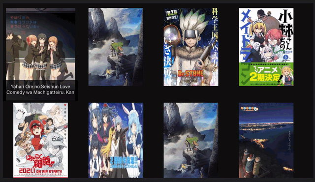

Title: Criando sua primeira APP para Smart TVs (Parte 2)
Category: Smart TV
Tags: Smart TV, Js, React
Date: 2020-04-09
Series: Criando sua primeira APP para Smart TVs
cover_image: smart-tv-plex.jpg
cover_image_by: Imagem retirada do <a href="https://www.popsci.com/resizer/lU2v75pLrtqZZV7TOZsVmhM7YbI=/1782x1336/filters:focal(600x450:601x451)/arc-anglerfish-arc2-prod-bonnier.s3.amazonaws.com/public/7SFVUBKE3F5G4N74QM7QJSGU4E.jpg" title="Tv com Plex">Google</a>
cover_image_alt: Smart Tv from google

Iai meu Polvo 🐙 como cês tão?

Dando continuidade a nossa série da criação de uma app para Smart Tvs, hoje nós iremos finalizar os testes e corrigir os bugs deixados no ultimo post.

<!-- PELICAN_END_SUMMARY -->

## Bug hunter:


<center><small>Fonte: [MonkeyUser](https://www.monkeyuser.com/)</small></center>

Enquanto eu navegava pela app, notei uma falha na parte da navegação, nós estamos **exibindo apenas** items relacionados a "TV" mas não estamos filtrando-os. Então ao chegar no final da lista, a navegação "continua" mesmo sem ter item para navegar. E para corrigir vamos modificar o código com:

```js
componentDidMount() {
    // [...]
    response.anime.forEach(element => {
        if (element.type === 'TV') {
        animes.push(element)
        }
    })
    // [...]
}

onKeyDown(e) {
    // [...]
    case 39: // right
        if (activeItem < animes.length
          && activeItem + 1 < animes.length) {
          newActiveItem += 1
        }
    break
    case 40: // down
        if (activeItem < animes.length) {
          if (activeItem + 4 > animes.length) {
            newActiveItem = animes.length - 1
          } else {
            newActiveItem += 4
          }
        }
    break

    // [...]
}

render() {
    const { animes } = this.state
    return animes.map((anime, i) => this.tmpl(anime, i))
}
```

## Hora dos testes:


<center><small>Fonte: [MonkeyUser](https://www.monkeyuser.com/)</small></center>

Como eu apenas adicionei a suite de test, e não realizei nenhum teste, está na hora de aumentar o nosso coverage! 😄
Para simplificar o post, eu vou deixar o [link do arquivo completo do teste](https://github.com/paulopotter/my-first-smart-tv-app/blob/post-2/src/App.test.js) para vocês verem. Mas vou destacar o seguintes pontos:

**Coverage**

Agora já estamos com **95%** do componente testado 🤩

**babel**

Foi necessário adicionar `@babel/plugin-transform-runtime` e com isso alterar o `.babelrc` para:

```json
{
    "presets": [
      [
        "@babel/preset-env",
        {
          "targets": {
            "esmodules": true
          }
        }
      ],
      "@babel/preset-react"
    ]
}
```

**package**

Precisamos instalar o *nock* (`yarn add -D nock`), e atualizar o nosso `package.json` (de uma olhada no [arquivo](https://github.com/paulopotter/my-first-smart-tv-app/blob/post-2/package.json), pois houveram modificações nas versões dos pacotes).


**Arquivo de mock**

Para poder testar sem ter que ficar batendo na api toda hora, eu criei uma pasta `__mock__` e adicionei um [arquivo de mock](https://github.com/paulopotter/my-first-smart-tv-app/blob/post-2/src/__mock__/Animes.js) lá.


**jest config**

Por causa do mock que precisamos fazer, temos que remover a pasta do `mock` do coverage:

```
// linha: 30
 coveragePathIgnorePatterns: [
    "/node_modules/",
    "/__mock__/",
  ],
```

## Melhorando a experiência:

Agora que nós possuímos uma tela funcionando, precisamos melhorar minimamente a experiência da mesma. E para isso, temos que corrigir a navegação vertical, visto que ao navegar para baixo, o scroll não segue o foco.

Vamos atualizar o css, adicionando altura para as imagens e depois dando um tapa no visual.

```css
body {
  background-color: #0f0f0f;
  color: #f1f1f1;
  height: 720px;
  overflow: hidden;
}
.wrapper {
  padding-top: 20px;
}

.poster-wrapper {
  display: inline-block;
  height: 390px;
  text-align: center;
  vertical-align: bottom;
  width: 310px;
}

.poster-wrapper figure {
  position: relative;
}

.poster-wrapper img {
  height: 321px;
  width: 225px;
}

.poster-wrapper--active img{
  height: 381px;
  width: 285px;
}

.poster-wrapper span {
  background-color: rgba(0,0,0,0.7);
  bottom: 0;
  display: none;
  font-size: 20px;
  left: 0;
  min-height: 15%;
  padding: 15px 10px;
  position: absolute;
  right: 0;
}

.poster-wrapper--active span {
  display: inline;
}

```

Agora vamos adicionar o efeito de scroll e para isso, precisamos de uma `div` envolvendo todo o conteúdo além de adicionar margin à ela automaticamente utilizando o `state`.

```js
constructor(props) {
    super(props)
    this.state = {
      // [...]
      wrapperStyle: { marginTop: 0 }
    }
}

// [...]

render() {
  const {
    animes,
    wrapperStyle,
  } = this.state
  return (
    <div className="wrapper" style={wrapperStyle}>
      {
        animes.map((anime, i) => this.tmpl(anime, i))
      }
    </div>
  )
}
```
Agora, para criarmos a animação, vamos adicionar o valor da altura dos itens (`390px`) ao `margin-top` da div `wrapper`. Então toda vez que apertarmos o botão para baixo vamos subtrair esse valor e para cima vamos adicionar esse valor.


```js
animate(keyCode) {
    if (keyCode === 40) {
      this.setState(prevState => ({
        wrapperStyle: {
          marginTop: `${parseInt(prevState.wrapperStyle.marginTop, 10) - 390}px`,
        }
      }))
    }

    if (keyCode === 38) {
      this.setState(prevState => ({
        wrapperStyle: {
          marginTop: `${parseInt(prevState.wrapperStyle.marginTop, 10) + 390}px`,
        }
      }))
    }
  }

```

e no `onkeyDown` eu chamo o animate:

```js
// linha 57
this.animate(40)
// linha 67
this.animate(38)
```

## É isso aí!

<center>
    
    <br/><small>Nossa app funcionando</small>
</center>

Ainda temos muita coisa para fazer porém, já temos o suficiente para testar na TV. No nosso próximo post, desta série, eu ire mostrar como testar essa app numa Smart TV da LG.

Lembrando que eu estou fazendo o mais básico de uma aplicação, para poder demonstrar como é funcionamento de uma app (web hosted) de smart tv. Coisas como organização do projeto, layout e player não estão sendo desenvolvidos, talvez em post futuros eu melhore a nossa app, mas você é livre para modificar a app da melhor forma que você achar 😉.


## Links uteis:

Antes de finalizar eu gostaria de recomendar que vocês deem uma olhada nos links do blog do meu amigo [Kevin Maduro (kcsmad)](https://kcsmad.wordpress.com/) que, alem de mostrar outro(s) (bons) ponto(s) de vista, complementam bem os posts sobre smart tv que eu estou fazendo.

- [Desmitificando o mundo das Smart Tvs](https://kcsmad.wordpress.com/2020/02/29/desmistificando-o-mundo-das-smart-tvs/)
- [Princípios básicos para aplicações de Smart Tv](https://kcsmad.wordpress.com/2020/03/01/principios-basicos-para-aplicacoes-de-smart-tvs/)


É isso, não se esqueçam de comentar e compartilhar e **até o nosso próximo post!**
